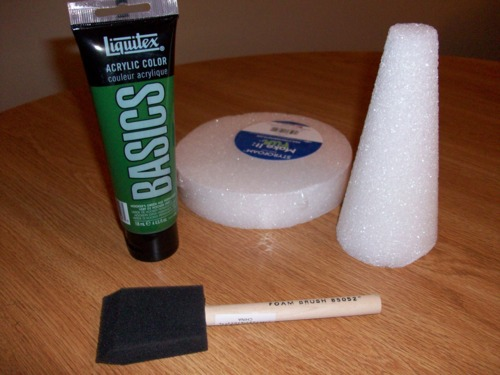
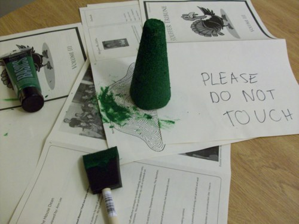
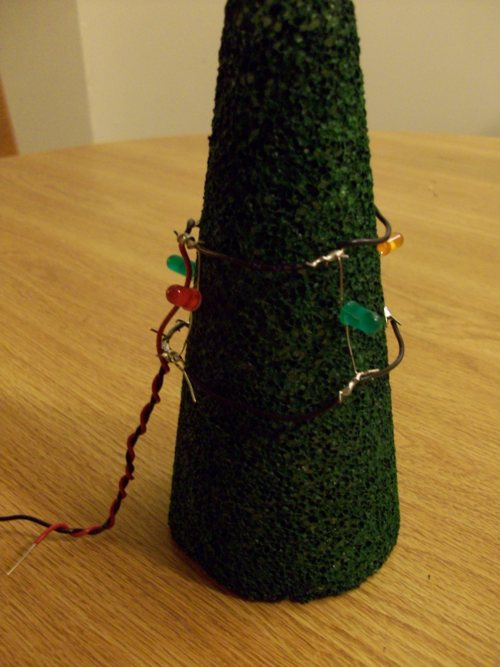
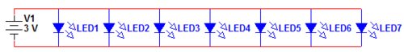
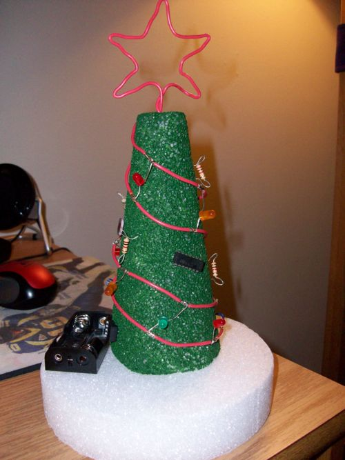
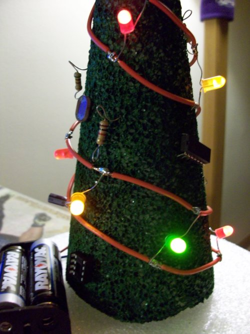

Every year around the holidays, my dorm, [Stouffer College House](https://stouffer.house.upenn.edu/), puts on a program called Holiday Hobbit. The name is just an attempt to make the program secular. It’s really just [Secret Santa](http://en.wikipedia.org/wiki/Secret_Santa) for Stouffer residents. The only rule is that you cannot spend more than $10 on the gift.

I decided to participate in the program this year. I was in the mood to do something creative, so I decided to make a Christmas decoration in the form of a table centerpiece. I also wanted to do something involving electronics, so I set out to create a miniature Christmas tree composed of LED lights and other assorted electronic component ‘ornaments.’ And I decided to call this project, The Circuit-Tree (read: circuitry…get it?).  Convinced that I wasn’t crazy by finding a [similar project](http://www.instructables.com/id/Mini-Christmas-Tree-With-Lights/) online, I decided to start by making the tree itself.

My initial idea was to make the whole thing using only circuit components. So I would construct the tree itself using high-gauge green wire formed in concentric loops. The high-gauge-ness of the wire would maintain the form of the tree. I was short on time and resources so I went down to the undergraduate electronics lab to see what parts I could use. Unfortunately, they were out of green high-gauge wire. But I saw some neat colored LEDs sitting on a table, so I grabbed some of those.

Since the high-gauge wire idea wasn’t going to work, I decided to try green pipe cleaners. I made a few calls and found out that Blick! Art Supplies in Center City had green pipe cleaners in stock. I went down to the store last week and checked out their selection of pipe cleaners. I was disappointed to see a limited selection. They had green pipe cleaners, but only about 5 in a pack of assorted colors.

I looked around the store for something else that would work and ended up in the Styrofoam section. There, I found a small conic piece that I thought would work well for the tree. I also found a short cylindrical piece I thought would work well for the base. The added benefit of Styrofoam is that the circuit components I would use for the ornaments could be inserted directly into the tree, and they probably wouldn’t fall out.

The two pieces of Styrofoam were stock white, so with the help of one of the store employees I picked out some Basic green acrylic paint. I also bought a small, inexpensive foam brush for the painting.



_Paint, Styrofoam pieces, and foam brush purchased from an art supply store_

The total of my purchases at Blick! was about $8, so I was close to hitting the $10 mark, but I knew that I already had a lot of the circuit components I needed (and I could always go take more from the Penn electronics labs).

It was easy enough to paint the conic Styrofoam piece using the acrylic paint, and it only took me about 15 minutes. I decided not to alter the base Styrofoam piece, since the white would look like snow.



_Painting the conic Styrofoam piece green_

Next, I set out to make the LED lights. Since these were actually going to light up, I needed to wire them up with a power line and a ground line connected to a battery. Here’s where I did something really…inefficient. I imagined two concentric loops of wire (one power, one ground) with LEDs wired in parallel between the two. The parallel-ness would ensure that if one LED burnt out, they wouldn’t all go out (of course, that’s the major flaw of wiring lights serially).

Some of the problems of using two concentric loops of wire are:

1. Since one of the loops is higher in altitude than the other, when you connect a power source you have to run a wire up to the higher loop, which isn’t very pretty.
2. You’re limited in the number of LEDs you can connect between the loops because you only get one row (unless you attach more LEDs to the existing LEDs and build outwards, bending attached LEDs over to the side so they don’t get in the way, but that’s not a very good solution)

I went ahead with this idea and soldered together one loop of wire by soldering individual lengths of wire in a circle, attaching LEDs at the junction of individual wires. Then, I put one loop around the tree and started constructing the second loop by soldering more individual wires to the free ends of the LEDs. Then I added the lines for power and ground and twisted them together (partly to keep them together and partly for aesthetics). When it was all said and done, it worked, but it wasn’t very pretty.



_The first LED lights design, using two concentric loops of wire for power and ground_

My friend and fellow electrical engineering major Shilpa suggested I run the power and ground lines diagonally around the tree with the LEDs in parallel in-between. I thought about it for a second and realized that her idea is infinitely better than mine. Here’s why:

1. The lines loop around the tree diagonally, ending at the bottom, which means that the battery can connect directly at the base of the tree without having to run wires up to the top of the tree.
2. Since running the lines diagonally creates multiple loops, and power and ground lines alternate, you can add many more rows of LEDs than my initial design. I chose not to do this because of time limitations, but I could have.

Shilpa also noticed that I created the loops using individual wires soldered together and showed me how I can strip a segment in the middle of a wire using a wire-stripper and a box cutter. This made things _so_ much easier.

With these ideas in mind, we sketched a schematic on paper.  I decided to omit a current-limiting resistor, mainly because I didn’t have a resistor small enough to do it, but also because we had seven LEDs in parallel and the battery probably wasn’t going to source that much current.



_The schematic for the Circuit-Tree, or at least the part that actually uses electricity_

I’m extremely grateful for Shilpa’s help because she soldered almost all of the LEDs while I was preoccupied with baking 50+ cookies for another Stouffer event.

We hooked up two AA batteries to the LED 'ladder’ and all of the lights lit up, so we started attaching the ladder to the tree.  We used some high-gauge red wire for the power and ground lines, so we bent them at the ends to create 'hooks’ that we could insert directly into the Styrofoam.  Shilpa had to leave, but I was able to do this easily enough.

Next, I used Shilpa’s method of stripping a middle segment from the power line and the ground line to create a space to solder wires to the battery holder. I had taken a 2xAA battery holder from one of the Penn labs. Once the battery holder was soldered to the lights, I inserted 2 AA batteries and was satisfied when all of the lights lit up.

The rest of the display was completed by using some really sticky double-sided tape I picked up in Korea to attach the tree and the battery holder to the base.  I also inserted a bunch of resistors, pots, capacitors, photo-resistors, and op-amps into the Styrofoam tree to act as 'ornaments.’  I bent small loops into the resistor terminals to make it look like an 'angel ornament,’ but I’m not sure anyone else would get that.  Lastly, I used some more of the high-gauge red wire to form a star for the top of the tree.  



_The Circuit-Tree minus batteries_

I also inserted a strip of paper with “PULL” written on it between one of the battery terminals to keep the lights off until it was removed.  

The finished product looked really good - much better than my initial design.  The final cost, with circuit components included, probably wasn’t more than $15.  

A final requirement of the Holiday Hobbit program was to include a note with a hint as to my identity, so I printed the following 'program’ and folded it between the two AA batteries:

```java
if (nice) {
    receivePresent();
} else if (naughty) {
    receiveCoal();
} else if (hobbit) {
    System.out.println(“Happy Holidays from your holiday hobbit”);
    System.out.println(“I hope you enjoy this ‘Circuit-Tree’!”);
    System.out.println(“:)”);
    receivePresent();
}
```

I gave the Circuit-Tree to my Holiday Hobbit and she said she really liked the gift, so mission accomplished!  Merry Christmas/whatever everyone!



_The completed Circuit-Tree_
