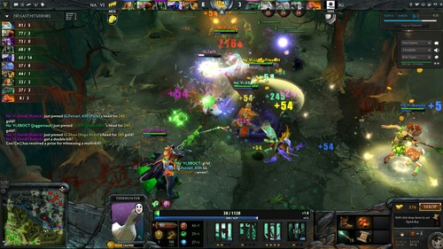
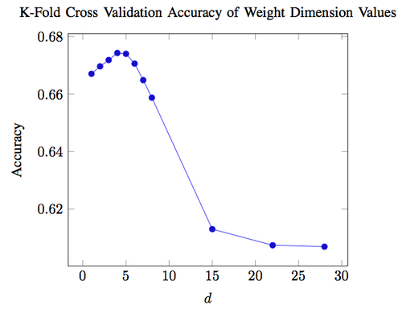
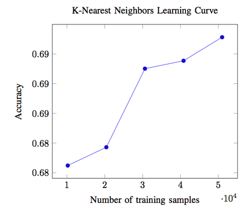



I took Stanford’s machine learning class, CS 229, this past quarter. For my final project, I worked with [Daniel Perry](https://www.linkedin.com/in/danieljamesperry) to apply a few different machine learning algorithms to the problem of recommending heroes for Dota 2 matches.

**TL;DR**: We achieved about 70% accuracy for predicting match outcomes based on hero selection alone using logistic regression, and we made a small improvement on that result using K-nearest neighbors.

[Download final report](https://github.com/kevincon/dotaml/blob/master/docs/final_report.pdf?raw=true)

[Code on GitHub](https://github.com/kevincon/dotaml)

## Introduction

Dota 2, the sequel to a Warcraft III mod called Defense of the Ancients (DotA), is an online multiplayer computer game that has attracted professional players and the arrival of international tournaments. Each match consists of two teams of five players controlling “heroes” with an objective of destroying the opposing team’s stronghold. There are 106 unique heroes in Dota 2 (circa December 2013).

Why work on a hero recommendation engine for Dota 2? A widely-believed conjecture is that the heroes chosen by each team drastically influences the outcome of the match. The positive and negative relationships between heroes can give one team an implicit advantage over the other team. Valve’s annual Dota 2 tournament, [The International](http://wiki.teamliquid.net/dota2/The_International/2013#Prize_Pool), had a prize pool of over $2.8 million dollars in August 2013. With that much money on the line, professional teams recognize the importance of hero selection. Some matches take up to ten minutes for hero selection by both teams.

Professional players spend thousands of hours practicing the game, so they tend to gain an intuition for picking heroes. This “gut instinct” is not as accessible to more casual players, so we thought it would be interesting to explore how machine learning could help solve the problem of recommending heroes.

## Related Work

In researching prior work, we discovered a web application called Dota 2 Counter-Pick (no longer available) that uses machine learning to recommend heroes for Dota 2 matches. From the website’s about page:

> We model hero picking as a zero-sum-game and learn the game matrix by logistic regression. When suggesting picks and bans we assume that teams are mini-max agents that take turns picking one hero at a time.
>
> Our growing database includes over 1 million matches from the high skill bracket where players did not disconnect or leave. For 63% of these matches, our method predicted the winning team correctly based on picks alone.

We were very inspired by the accuracy of Dota 2 Counter-Pick, and we set out to improve on their results.

## Data Collection

We used the [Steam Web API](https://dev.dota2.com/forum/dota-2/spectating/replays/webapi/48733-dota-2-match-history-webapi?t=47115) for collecting data about public Dota 2 matches. We wrote a Python script (called [`dotabot2.py`](https://github.com/kevincon/dotaml/blob/master/data_collection/dotabot2.py?source=cc) in the GitHub repository) and set it up on a cron job to record data from the 500 most recent public matches every 20 minutes. We only considered matches that satisfied the following requirements:

1. The game mode is either all pick, single draft, all random, random draft, captain’s draft, captain’s mode, or least played. These game modes are the closest to the true vision of Dota 2, and every hero has the potential to show up in a match.
2. The skill level of the players is “very-high,” which corresponds to roughly the top 8% of players. We believe utilizing only very-high skill level matches allows us to best represent heroes at their full potential.
3. No players leave the match before the game is completed. Such matches do not capture how the absent players’ heroes affect the outcome of the match.

We filtered our dataset on some of these requirements after running `dotabot2.py`, so that script’s `is_valid_match()` function does not account for all three of these requirements.

The data for each match is structured as JSON and includes which heroes were chosen for each team, how those heroes performed over the course of the game, and which team ultimately won the game. We stored the JSON for each match in a MongoDB database during data collection.

We collected data for 56,691 matches between November 5, 2013 and December 7, 2013. We exported 90% of the matches from our database to form a training set of 51,022 matches. We exported the remaining 10% of our database to form a test set of 5,669 matches.

## Picking a Feature Vector

Machine learning algorithms typically require an input query to be described as a vector of features. For our feature vector, we came up with the following scheme to describe which heroes were chosen by each team in a match:

In Dota 2 matches, one team is called the “radiant” and the other team is called the “dire.” These terms are roughly analogous to “home” and “away,” as they only determine the starting point of each team on the game world map, which is roughly symmetric.

There are 106 heroes in Dota 2 (circa December 2013), but the web API uses hero ID numbers that range from 1 to 108 (two hero IDs are not used), so for our algorithms we used a 216-element feature vector, \\( x \\), such that:

$$
\begin{aligned}
x_i &= \begin{dcases}
        1 \text{  if a radiant player played as the hero with id } i\\
        0, \text{ otherwise}
        \end{dcases}\\
x_{108+i} &= \begin{dcases}
        1 \text{  if a dire player played as the hero with id } i\\
        0, \text{ otherwise}
        \end{dcases}
\end{aligned}
$$

We also defined our label, \\( y \\), to be:

$$
\begin{aligned}
y = \begin{dcases}
        1 \text{ if the radiant team won}\\
        0, \text{ otherwise}
        \end{dcases}
\end{aligned}
$$

## Making Predictions

Since our dataset contains information about heroes on teams in specific radiant vs. dire configurations, simply running our algorithms on each match in our dataset using the feature vector described above does not fully utilize all of the data.

Instead, we make predictions using the following procedure. Given a match feature vector, which we call `radiant_query`:

1. Run the algorithm on `radiant_query` to get `radiant_prob`, the probability that the radiant team in `radiant_query` wins the match.
2. Construct `dire_query` by swapping the radiant and dire teams in `radiant_query` so that the radiant team is now the bottom half of the feature vector and the dire team is now the top half of the feature vector.
3. Run the algorithm on `dire_query` to get `dire_prob`, the probability that the radiant team in `radiant_query` loses the match if it was actually the dire team instead.
4. Calculate the overall probability `overall_prob` as the average of `radiant_prob` and `(1 - dire_prob)`.
5. Predict the outcome of the match specified by `radiant_query` as the radiant team winning if `overall_prob > 0.5` and as the dire team winning otherwise.

This procedure accounts for matches in our dataset that might not have the team configuration of a given query in one direction (e.g. radiant vs. dire) but may have the configuration in the other direction (e.g. dire vs. radiant).

## Validating the Importance of Hero Selection Using Logistic Regression

Logistic regression is a model that predicts a binary output using a weighted sum of predictor variables. We first trained a simple logistic regression model with an intercept term to predict the outcome of a match.

A plot of our learning curve for logistic regression is shown below. The test accuracy of our model asymptotically approaches 69.8% at about an 18,000 training set size, indicating that 18,000 matches is an optimal training set size for our logistic regression model.

We believe that this logistic regression model shows that hero selection alone is an important indicator of the outcome of a Dota 2 match. However, since logistic regression is purely a weighted sum of our feature vector (which only indicates which heroes are on either team), logistic regression fails to capture the synergistic and antagonistic relationships between heroes.

## Predicting Match Outcome Using K-Nearest Neighbors

K-nearest neighbors (KNN) is a non-parametric method for classification and regression that predicts objects’ class memberships based on the k-closest training examples in the feature space.

We chose to implement KNN in order to better model the relationships between heroes instead of simply taking into account wins when a hero is present.

At a high level, we continue to focus on wins and the hero composition of teams, however with KNN, we have an avenue to weigh matches according to how similar they are to a query match we are interested in. For example, if we are interested in projecting who will win a specific five on five matchup (our query match), a match with nine of the heroes from the query match present will give us more information on who will win the query match than a match with only one hero from the query match present.

We used a custom weight and distance function and chose to utilize all training examples as “nearest neighbors.” Our polynomial weight function described below aggressively gives less weight to dissimilar training examples:

$$
\begin{aligned}
w_i &= (\frac{ \sum_{j=1}^{216} AND(q_j, x^{(i)}_j)}{NUM\_IN\_QUERY})^d
\end{aligned}
$$

Here, \\( x^{(i)} \\) represents the feature vector for training match \\( i \\) and is compared by the logical \\( AND \\) operator to query vector \\( q \\). Index \\( j \\) represents the hero ID index of each respective vector. \\( NUM\\_IN\\_QUERY \\) represents the number of heroes present in the query vector. For example, \\( NUM\\_IN\\_QUERY \\) is 10 if the query contains all 5 heroes for each team.

The function is normalized to be between 0 and 1, and it gives more weight to matches that more closely resemble the query match. To do this, the function compares the query match vector to the training match vector and counts every instance where a hero is present in both vectors.

A larger \\( d \\) parameter will result in similar matches getting much more weight than dissimilar matches. Alternatively, a low \\( d \\), for example \\( d = 1 \\), will result in each match being weighted solely by how many heroes in common the match has with the query match. Stated another way, a high \\( d \\) will choose to put more emphasis on the synergistic and antagonistic relationships between heroes, while a lower \\( d \\) will put more emphasis on the independent ability of a hero.

To choose the optimal \\( d \\) dimension parameter described above, we used k-fold cross validation with \\( k = 2 \\) on 20,000 matches from our training set and varied \\( d \\) across otherwise identical KNN models.

Since KNN must compare the query match to every match in the training set and compute weights and probabilities, this process was quite slow and took about ten hours. Due to time constraints, using more folds or more matches would have taken too long to finish.

A graph of the accuracies achieved when varying the weight dimension for a KNN model trained on our training set and evaluated on our test set is shown below. We found the optimal weight dimension to be \\( d = 4 \\), which achieved a mean accuracy of 67.43% during the k-fold cross validation.

A plot of our learning curve for KNN is shown below. The test accuracy of our model monotonically increases with training set size up to nearly 70% for around 50,000 training matches. Because we do not see the learning curve level off, this may imply that more data could further improve our accuracy.

## Recommending Heroes Based on Predicted Match Outcome

We recommend heroes for a team using a greedy search that considers every possible hero that could be added to the team and ranks the candidates by probability of the team winning against the opposing team if the candidate was added to the team.

Our recommendation engine is modular so that either of our algorithms could be used to recommend heroes. Given the ID numbers of the heroes on both teams, the recommendation engine proceeds as follows:

1. Create a feature vector for the match.
2. Create a set of new feature vectors, each with a different candidate hero added to the original feature vector.
3. Run an algorithm to compute the probability of victory with each feature vector from step 2, averaging the probabilities of the team winning in both radiant and dire configurations as described earlier.
4. Sort the candidates by probability of victory to give ranked recommendations.

## Future Work

Despite the high accuracy of our K-nearest neighbor model, the performance was quite slow. The five data points we used in our learning curve took about four hours total to calculate, and the k-fold cross validation used to find the optimal weight dimension took over 12 hours.

We believe that the performance of our K-nearest neighbor model could be improved in a number of ways. First, the binary feature vector used could be stored as an integer in binary representation to improve memory usage. Second, the calculation of weighted distances could be parallelized across multiple CPU cores. Third, a GPU could be utilized to vectorize the weighted distance function calculations.

Although the version of the game did not change during the time we collected match data, a new patch is released for Dota 2 every few months that dramatically changes the balance of the game. Therefore, we believe that a sliding window of match history data that resets when a new patch is released could help maintain data relevancy. For this reason, it would be useful to find if there is a training match size for which performance levels off so that we could collect only as much data as is needed.

Finally, we could experiement with a different search algorithm for our recommendation engine such as A* which would account for the opposing team picking heroes that could counter our initial recommendations. However, due to time constraints we were not able to implement A* search for our recommendation engine.

Ultimately, we believe there are many promising directions which future explorations in this area could take.

## Conclusion

We don’t claim to be experts on Dota 2 or machine learning, but we are encouraged by our results that machine learning could be an effective tool in recommending heroes for Dota 2 matches. Feel free to contribute to the project on GitHub and contact us with any questions.


