Before I went to college I purchased a Gateway M6755 laptop.  It has served me well for the past two years, but two years of schoolwork, instant messaging, coding, and Tetris can do a lot of damage to a laptop, particularly its keyboard.

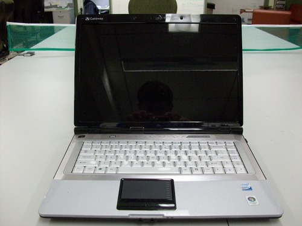

About a week ago I took my laptop out on an [AutoPlug](https://www.youtube.com/watch?v=Ah08y-Q0tBw) test drive.  While we were driving, it started to rain and my laptop got a little wet.  I didn’t think much of it, but later that weekend I discovered that I could no longer type the characters ‘g’ and 'h’ nor could I press the backspace key.  If I tried to press those keys, nothing would happen.  After some fiddling and cleaning attempts, I decided I needed a new keyboard.

Not only were those keys not working, but my keyboard was also dirty and several of the keys had begun to fade.  This is not only bad for aesthetic reasons, but most of the time the keys that fade are the ones you press the most.  For example, letters that make up the passwords you use for your computer, email, programs, etc.  So replacing the keyboard is also a good idea for security reasons.

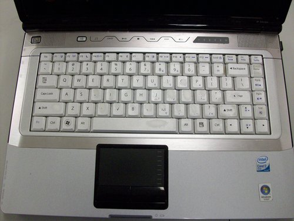

I ended up purchasing the exact same part from a website called B2Cmarts.  I believe they’re located in China, but the part I ordered was shipped from San Jose, CA.  I ordered the part on Monday and it arrived on Thursday, so shipping was pretty fast.

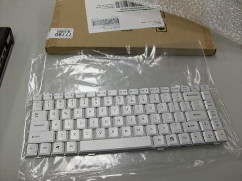

## What You’ll Need

1. Phillips Head Screwdriver
1. Flat Head Screwdriver
1. Anti-static wrist strap (optional, but probably a good idea)

## Removing the Battery

Before you do any sort of hardware replacements like this, you’ll always want to shutdown the laptop and remove its battery.

You can remove the battery by first sliding this switch from the lock icon to the unlock icon.

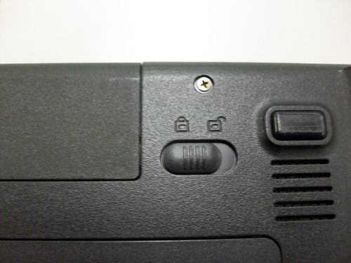

Then, slide this switch forward and simultaneously push the battery out.

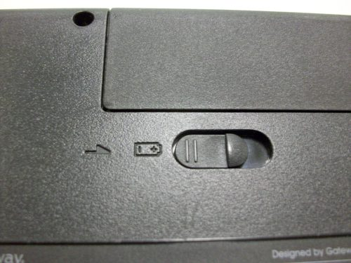

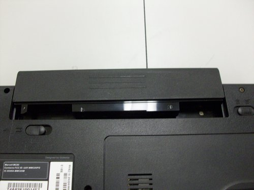

## Replacing the Keyboard

Now that the battery’s been removed, we’re good to replace the keyboard.

Start by removing the screw from the underside of the laptop marked by a K (for keyboard!).

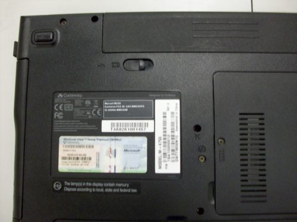

Next, flip the laptop over and open it to look at the keyboard.  You’re going to be removing the plastic bar between the keyboard and the screen (the one that has the power button and multimedia shortcut buttons).  

**Before you do this, know that the bar has a ribbon cable under it attached the rest of the computer.  So you’re just going to pull it up from the computer, not completely remove it.**

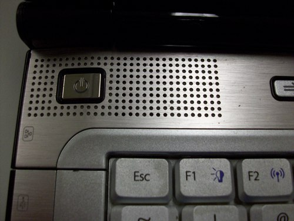

To pull up the bar, insert a flat head screwdriver in the crack between the bar and the keyboard, and very carefully pry the bar up from the computer.

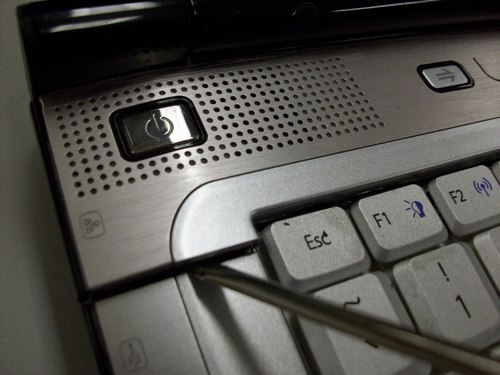

Here you can see the ribbon cable that connects the bar to the rest of the computer.

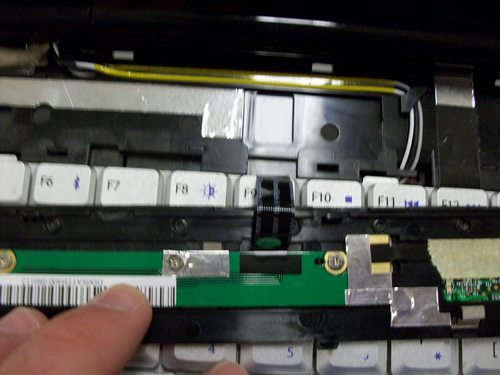

You can just let the bar chill up against the screen for now.

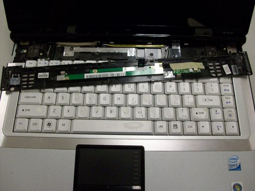

Next, remove the screws that attach the keyboard to the computer.  They’re located above the F1 and Insert keys.

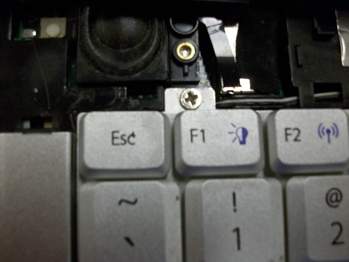

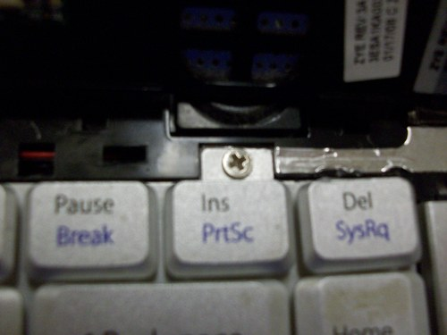

Now, pull the keyboard up slowly.  The keyboard is connected to the computer via a ribbon cable.  

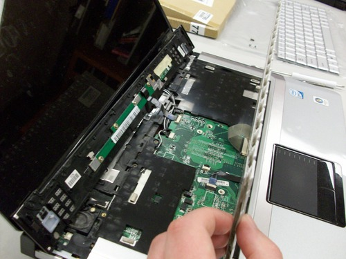

You need to push the brown tabs of the ribbon cable connector towards the laptop’s screen to unlock the ribbon cable.  In the image below, the ribbon cable has been unlocked (brown connector forward).

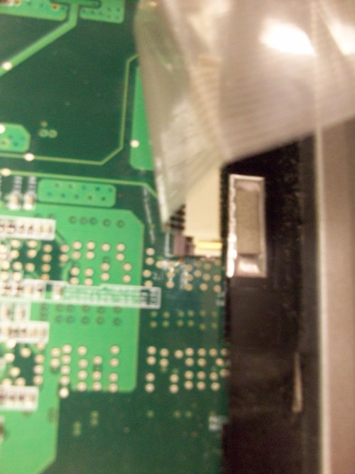

Now you can completely remove the old keyboard from the laptop.  Here’s a picture of my old keyboard (top) next to my new keyboard (bottom).

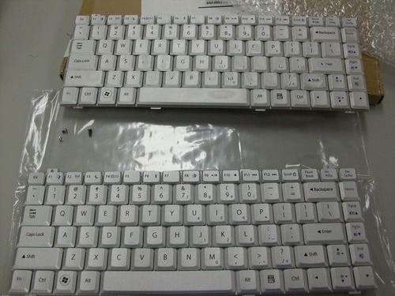

I don’t have pictures for installing the new keyboard, but all you need to do is reverse the process you used to remove the old one.  So:

1. Insert the new ribbon cable into the connector.
1. Close the brown tabs.
1. Insert the keyboard in place.
1. Replace the keyboard screws.
1. Pop the power/multimedia bar back into place.
1. Flip the laptop over.
1. Replace the “K” screw.
1. Replace the battery.
1. Flip the lock switch back to the lock icon.

Now you should be able to plug in the laptop’s power adapter and press the power button.  In my case, replacing the keyboard fixed my broken 'g’, 'h’, and Backspace keys.

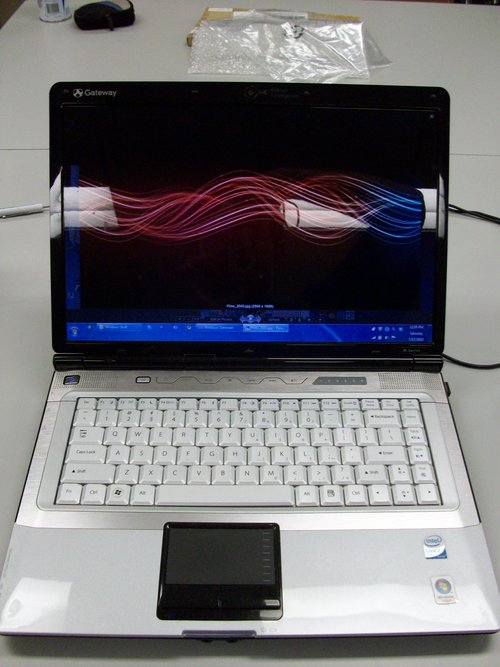
