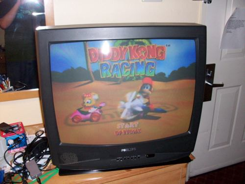
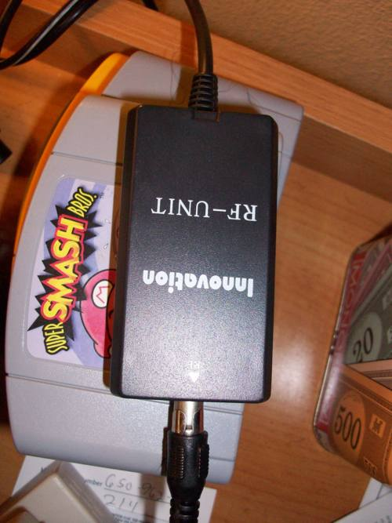
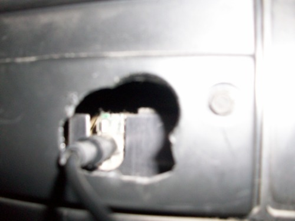

I thought about entitling this article “How to Play Nintendo 64 on a Philips 7225 C107 Hotel TV,” but I figured this crazy procedure could be generalized for anyone trying to hook up a peripheral device to this particular type of TV.

First, a little back story:  I’m staying at an extended stay hotel in Mountain View, CA for the summer while I work at [Bump Technologies](http://bu.mp). The hotel is very nice with a few minor exceptions (weak Internet signal and no oven).  

One slightly more annoying problem is that the room’s TV only has a coaxial cable/antenna input. No composite video. No S-video. Nothing else. I brought my Nintendo 64 with me hoping to play it on the TV, but first I would need to purchase a Nintendo 64 RF switch, which lets you connect a Nintendo 64 to older TVs through the coaxial cable/antenna input.

I purchased the Innovation INNOV6917 Gamecube/Nintendo 64 RF Switch from Tiger Direct.  It actually looks quite a bit different than the picture on Tiger Direct; there’s no “ANT IN” port, there’s no Channel switcher (it’s hard-coded to channel 3), and the enclosure is a black rectangular prism.

I hooked up the Nintendo 64 RF Switch to the TV and turned on the Nintendo 64. Sweet! Now I just need to change the channel to 3…wait, what? This particular TV gave me the message “Channel 3 Unavailable” whenever I tried to go to channel 3. In fact, it gave me that error message if I tried to access any channel other than the default cable channels the TV received.

Normally I would go through the TV’s menu to do a new channel search, but this TV was just not cooperating. The only menu functions available (via the TV’s front panel) were Closed Captions and Sleep Timer. Hmm…

To the Internetz! I ran a bunch of searches trying to find a service manual for the TV that might contain a secret code I needed to enter on the remote to enter the super secret “service mode.” I didn’t find anything like that, but I did find a bunch of complaints from other consumers who had experienced the same problem as me. Some said reprogramming the remote with a certain remote code unlocked more menu functionality, but the universal remote that came with the hotel only accepted 3 digit codes, not the 4 digit code described.

After a fair amount of searching, I decided to go ask the hotel’s front desk for advice. I told the guy behind the counter that I was trying to hook up a Nintendo 64, and he said, “As a gamer, I would just say fiddle with it until it works.” I also asked if there was a TV serviceman for the hotel, and he said they had a general maintenance guy, but he wouldn’t be available until Monday.

Fiddle with it until it works? Not the best advice to give regarding CRT TVs, considering the thousands of volts they can contain even when powered off and unplugged. Still, I thought I would try one last thing.

Something odd about the TV in my room was that the coaxial cable/antenna input port was actually hanging out from the back of the TV, and part of the inside of the TV was exposed through what was clearly a hole cut by someone. Maybe it was done by a TV repairman, or maybe it was done by a previous tenant who knew the secret to accessing channel 3…

The coaxial cable/antenna input was actually a cable itself connected to an unknown RCA port on the inside of the TV. I could see it with my flashlight, and it was reachable with needle nose pliers, and that’s when I got an idea.

I really don’t know what I was thinking, except that I thought maybe if I could match up the inputs and outputs just for the TV and N64 maybe something would show up on the screen.

Well, it did work. And I don’t know why, but here’s how to connect a Nintendo 64 to a Philips PC7225 C107 Hotel TV. I happened to have the NES RF Switch with me as well, so you might have to purchase one in addition to the N64 RF switch. I highly recommend you power down the TV and disconnect it from the wall before “fiddling” with it. And if the inside of the TV is not accessible for you, you might have to cut a hole yourself, although I don’t advocate vandalising hotel property.

Once those connections are made, you can turn on the TV. You’ll notice of course that the cable channels are unavailable, since the cable is disconnected. I discovered that the Nintendo 64’s picture and sound came in on channels 8, 14, and 27, with channel 14 seeming to be the strongest.

So why did this work? I really don’t know. The connections seem to be completely backwards. I also wonder what would have happened if the Nintendo 64 RF Switch was set to appear on channel 4 instead of channel 3. Maybe everything would appear on a different set of three channels. There may even be an easier way to make this work, but I was working with what I had, and I’m just glad it worked.  

I’m interested in what kind of circuitry actually goes into the RF Switches, so I might look into that. In the meantime, I’m going to go play Diddy Kong Racing!
