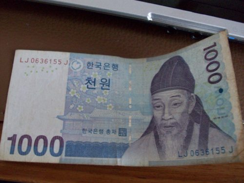
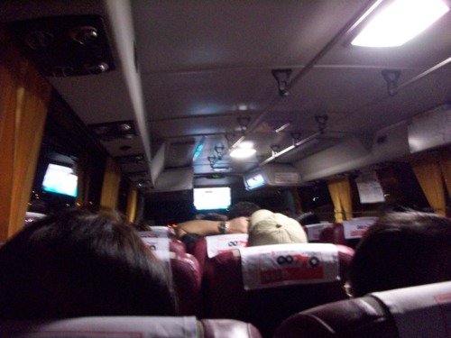
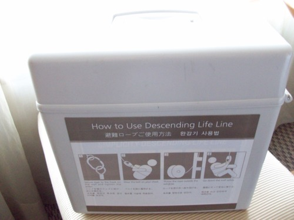
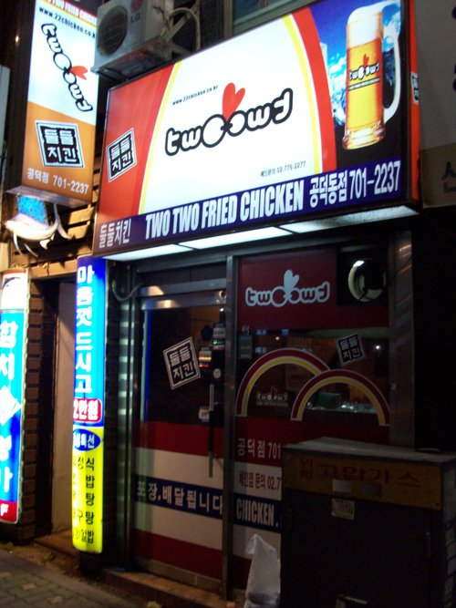


This post is part of a series of journals I wrote while traveling to Seoul, South Korea to compete in the 2010 World Embedded Software Contest, for which my team's project won the grand prize.


We took the last train from 30th St. station to Trenton at 12:01 AM. We got to the Newark Airport around 2 AM, and then we waited around until they opened the security checkpoint around 3:30 AM. We were lucky that they didn’t give us any trouble about the electronic components we were carrying for [AutoPlug](https://www.youtube.com/watch?v=1YGamFKYLnA) (our demonstration unit consists of a Tupperware box with a battery pack and several circuits inside, and there’s an antenna sticking out of the top, so yeah it pretty much looks like a bomb). Anyway, we have a letter from our professor on Penn letterhead explaining what we were carrying and what it was for. Newark’s airport is pretty nice, but I wasn’t too happy with their lack of electrical outlets. There seemed to be just one “charging station” (sponsored by Samsung!) for our area in the airport. I was surprised to see that the flight from Newark to San Francisco had TVs with DirectTV on the back of every seat. But it made you pay $6 if you watched past the “trial time” of like 15 minutes.

The airport in San Francisco was a little bit hectic because our flight was a little late getting in. They had actually already closed the check-in counter for all Asiana flights. Luckily the flight to Korea was delayed about an hour, and they called someone over to print our boarding passes. The flight to Incheon was awesome. I don’t know why more economy domestic flights don’t have a TV in the back of the seat. It makes the flight so much better. They had some pretty great movies on there too. I finally got to watch Despicable Me, Salt, and Grown Ups. The food was very good too. They served us Beef Steak for one meal and chicken and pasta for another.

_1,000 Korean Won (about 88 cents at time of writing)_

Passing through immigration in Korea was a breeze, and we stopped to exchange some currency. I exchanged $20 and received 21,700 won (I’m rich!). When we got to the airport exit we were approached by a couple of different guys wanting to drive us to the hotel in a taxi. We said no thanks and checked with the information desk and found a bus that would take us there for 10,000 won. As we were leaving the airport we were approached by the same guy, and just for fun we asked him how much it would cost us for him to take us to the airport in his taxi. He avoided the question for a minute but then finally said, “Real cheap: 85,000 won.” I’m no math major, but something told me that wasn’t a very good deal. We took the bus, and it was actually a really luxurious bus, with a big screen TV at the front and really comfortable seats. Unfortunately we missed our stop to get to the hotel, but all of the stops in the area were really close together so it was easy to get off and walk back.

_Airport Limousine Bus that took us to the hotel_

Our hotel is very luxurious. I’m not sure if it has a star rating, but I found a plaque outside the hotel with five flowers on it (five flower hotel?). The room is very comfortable. I found something really strange in the hotel though. Really strange and really awesome. In the corner of the room was a box labeled “Descending Life Line.” According to the instructions, it’s basically a rappelling kit you can use to escape from the room in case of an emergency. You attach the line to a hook on the wall in the room, wrap the belt around your waist, and then rappel down the building’s wall. Awesome, right?

_“Descending Life Line” Rappelling Kit that came with the hotel room_

After getting settled in the hotel, we were pretty hungry so we walked around the area near the hotel looking for food. We managed to find a fried chicken restaurant called Two Two Fried Chicken. We weren’t having much luck communicating with the lady making the chicken, but luckily someone in the restaurant spoke some English so we were able to order two things of chicken, one with seasoning and one with sauce. The order also came with two Pepsi cans, Korean Pepsi cans. I also had a Korean Coke on the flight to Seoul. In my opinion, Korean Coke is better than American Coke, but still not quite as good as Mexican Coke. We went to bed almost immediately after eating the chicken, because we had to get up early to get on the shuttle that would take us to the competition venue.

_Korean fried chicken restaurant_
