
This post is part of a series of journals I wrote while traveling to Seoul, South Korea to compete in the 2010 World Embedded Software Contest, for which my team's project won the grand prize.


We woke up early and went to the hotel’s restaurant, called Naru, to eat breakfast. It was a buffet and I was glad to see some eggs, bacon, and sausage after the fried chicken events of the night before. After breakfast we got all of our AutoPlug supplies together and went to the lobby to wait for our shuttle. There we noticed a few other International teams. We introduced ourselves to a group of students from Germany and Finland. Their project was a radio-controlled hovercraft! So cool! It looked inexpensive to make too: just Styrofoam, duct tape, CPU fans, and microcontrollers. We also spoke with a woman from Australia, Jenny, who happened to be representing the Serval project I had read about online. Their project is very cool, it is a peer-to-peer network for cell phones that replaces the need for cell towers.

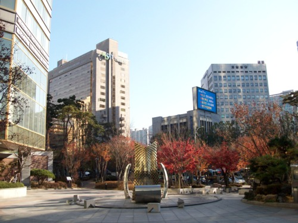

_View from the outside of the hotel.  Beautiful!_

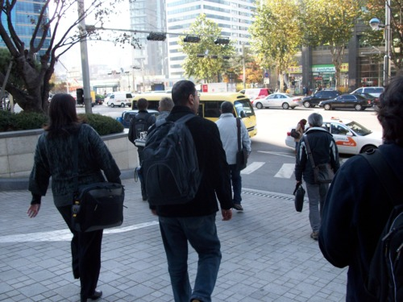

_Walking to the yellow shuttle bus to take us to the competition venue_

We met a representative from the competition named Kristen and she led us to the shuttle bus. The shuttle drove us about 15 minutes to Digital Media City and The Business Tower where the competition was going to be held. We went up to a conference room where we met all of the other teams and had our orientation.

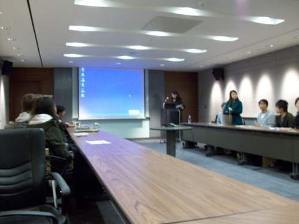

_Orientation, meeting the other teams, general info session_

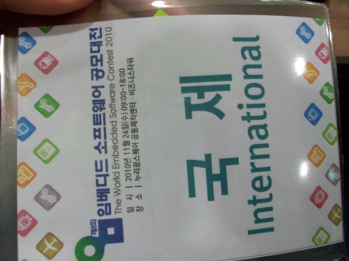

_Woo!_

There are 8 international teams total, from 12 countries. We are the only American team in the competition. They gave us a lanyard/ID tag to wear and also our food tickets for the competition lunches. We also met our interpreter, Kai. She will help us present AutoPlug to the non-English-speaking judges and also provide general advice/guidance. The breakdown of the eight teams and their projects are:

1. AutoPlug – University of Pennsylvania (our project)

2. Serval – INSA De Lyon (concept of a peer-to-peer network of cell phones called “bat phones” to eliminate the need for cell towers)

3. Hoveralls – Metropolia Finland (low-cost radio controlled hovercraft)

4. REDEYES – IIIT Hyderabad India (virtual gaming platform using spinning mirrors and lasers to project a ping-pong ball that you can use special gloves to play ping-pong with)

5. DCL-OSRG - Waseda University Japan (tool for monitoring and virtualizing multicore embedded software)

6. iNuC – Academia Sinica/ NationalTaiwan Univ. (Intelligent Nursing Cart for nurses in hospitals)

7. Unique Studio - Huazhong Univ. (Android app that lets you edit photos. Over 20 effects!)

8. Hongkong Polytech Univ. (I didn't catch exactly what their project was about, but it involved reusing discarded flash drives for larger storage units)

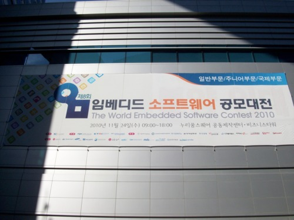

_Giant sign!  Legit!_

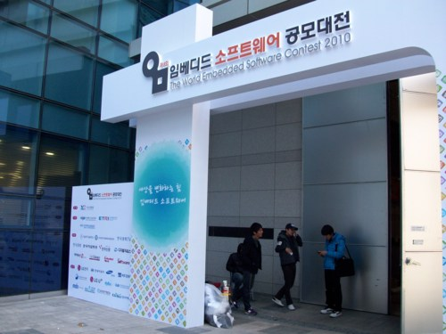

_Giant arch!  Legit!_

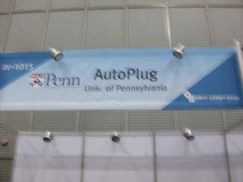

_AHHH! Too much legitimacy!_

The rest of the day was spent preparing for the official competition the next day. We had brought a bunch of duplicates of the components that go into making the blue-box gateway for AutoPlug, and we mounted them on a poster board and labeled the components very neatly. We also finalized our powerpoint presentations and demonstration.

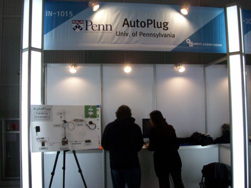

_Madhur and Kai check out our booth setup._

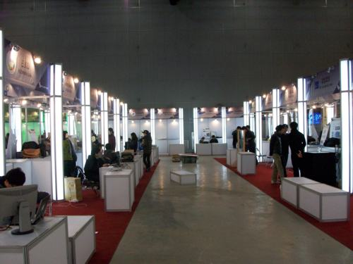

_This is what the competition venue looks like with all the booths._

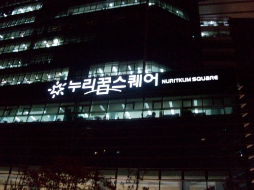

_Outside of the venue at night._

We broke for lunch around noon and Kai led us to the Food Court. The Food Court was a very interesting experience. Unlike American mall food courts, you order whatever you want from a counter that is outside the court, and then you receive a number which represents your order. When your order is shown on an LCD monitor, you go to that specific restaurant in the Food Court and pick up your order. Kai recommended a beef soup dish so we got that and it was pretty good. Over lunch we learned that Kai is doing post-grad work studying to become a professional interpreter (so this job was perfect for her!). She did her undergrad in computer science so she had enough of a technical background to understand what our project was about. Once we got our food I asked Kai where we could get something to drink. She started looking for a nearby convenience store. This confused me, but Kai explained that usually Koreans don’t drink anything with their food (that’s what the rice is for, she said). I thought this was interesting, but afterwards we saw a place in the Food Court where you can fill a small silver cup with water to drink.

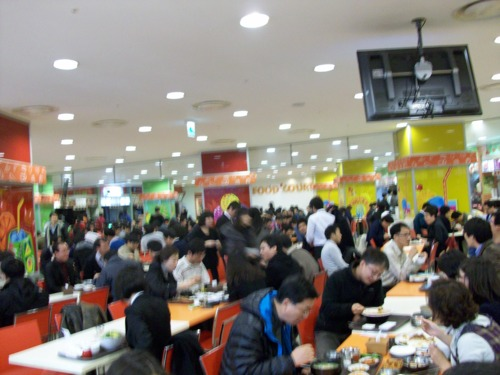

_Soooo many people at the Food Court!_

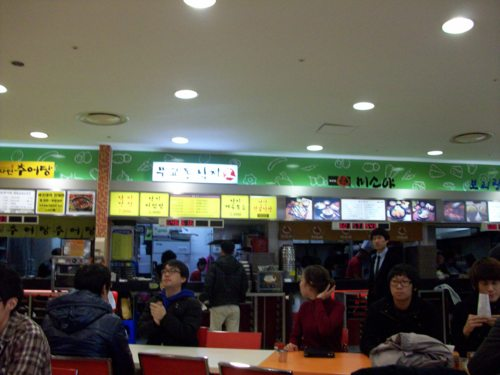

_You can see the different restaurants of the Food Court in the background._

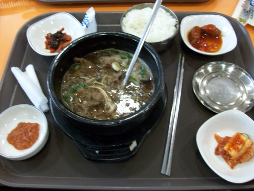

_This is what I had for lunch.  Does anyone know what it is called?_

After preparing for the competition all day we took the shuttle back to the hotel. Kai told us that our hotel was in an area in Seoul famous for its Korean BBQ restaurants. She recommended a restaurant called Chae Dae Po and said it was nearby. So when we got back to the hotel we put our stuff down and looked up directions to Chae Dae Po. Unfortunately it was all in Korean, but we got the general area down. It was about a block away from the hotel and we were able to ask someone on the street to point us the rest of the way. Chae Dae Po was a very interesting experience. Pretty much no one in the restaurant spoke English. We were led to a table with a grill built into the top and we sat down on red stools. A waiter came by and had zero luck communicating with us. He went away and brought back a girl who spoke a very tiny amount of English. She wrote on paper what we could order: either pork or beef with two options for each. We ordered one sweet pork and one salty pork. She brought out a bunch of bowls with vegetables and sauces and then brought out the meat. She cooked the meat right in front of us on the grill and let us know when it was done. We managed to communicate with her enough to find out that she was 18 and a sophomore in high school. She said that’s where she was learning English. When we were finished we went to the front to pay. The guy who was going to clean our table off bowed to me and I sort of awkwardly bowed back.

We pretty much immediately went to sleep back at the hotel, because we had to wake up early for the competition!
