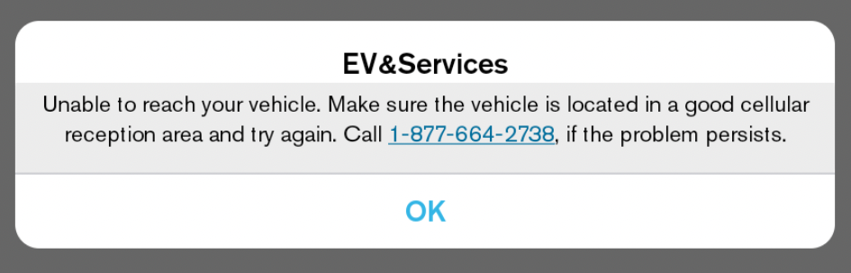
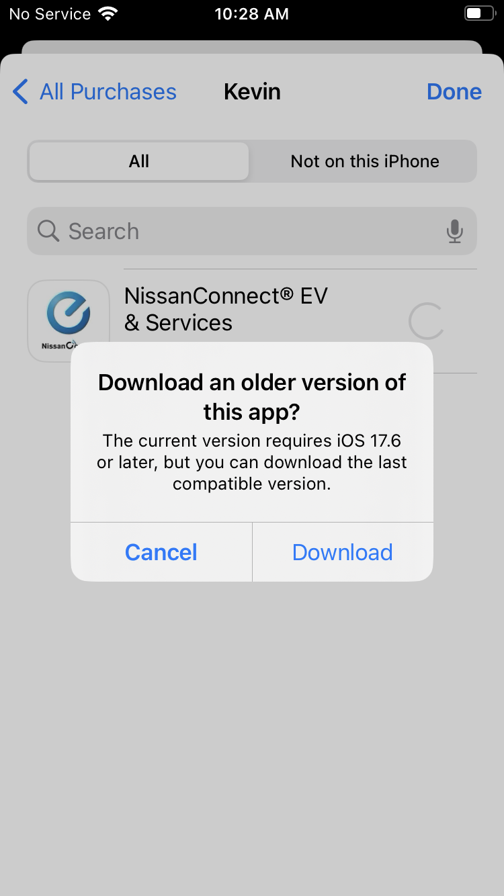
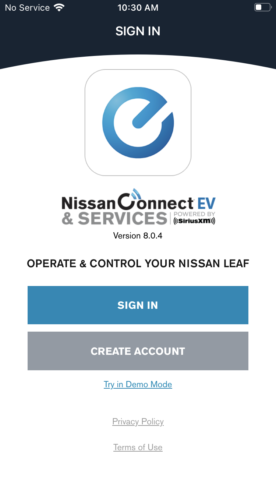
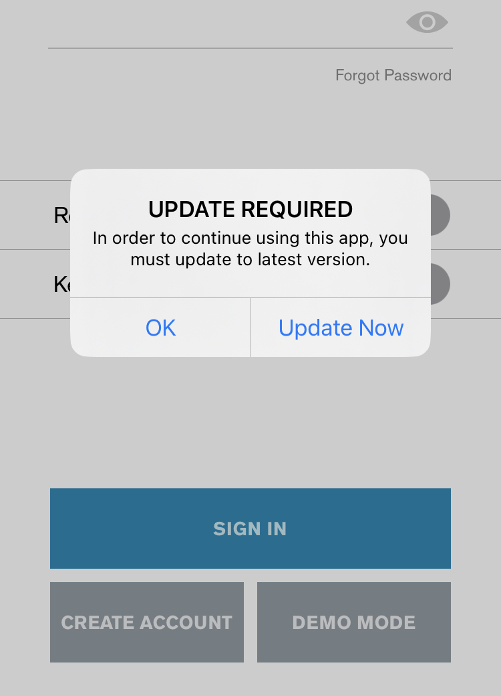
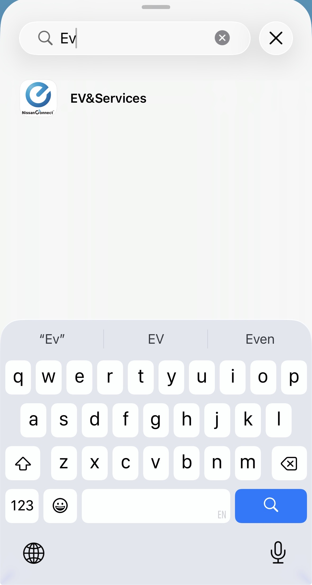
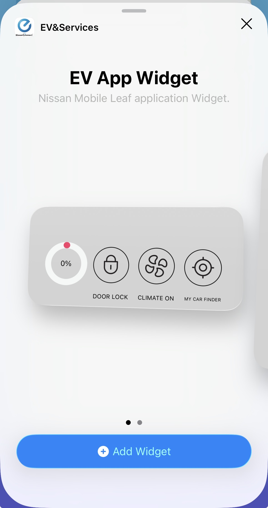
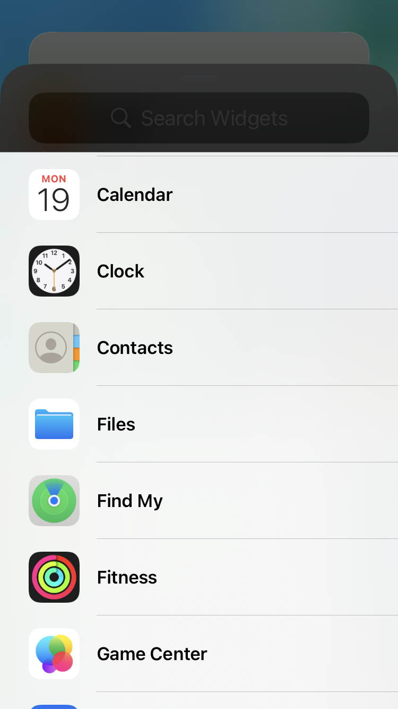
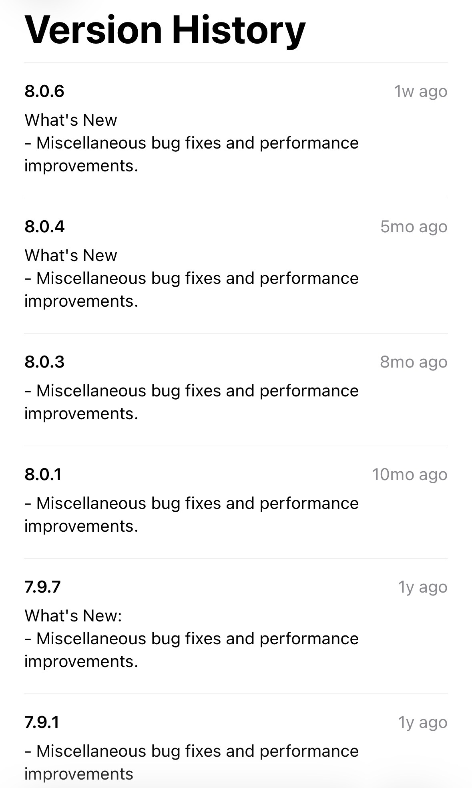
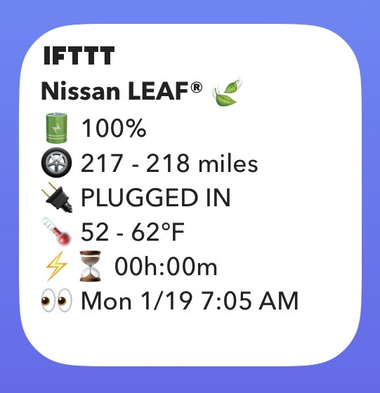

## Previously On

Last year I [wrote]() about my side project to create an iPhone home screen widget for my Nissan LEAF® electric car since Nissan's official [NissanConnect® EV & Services iPhone app](https://apps.apple.com/us/app/nissanconnect-ev-services/id407814405) ~~does~~ did (!) not provide one.

To recap: I developed a free automation that scraped the NissanConnect app on a Raspberry Pi running Android, formatted the resulting data, and sent it to an IFTTT applet that automatically updated a widget on my iPhone's home screen so that I didn't have to manually open the app and wait for it to refresh to check things like battery charge level, available range, and cabin temperature:


For almost 8 months this automation ran twice a day without any issues, and my wife and I enjoyed easily and quickly checking the automatically updated status of our car using the widget on our phones.

## Breaking News

Then, on January 7, I received an email from GitHub Actions alerting me that the automation had failed.

I checked the failing run's logs and found this error message:

```
adb:
failed to install /home/runner/work/_temp/apk/com.aqsmartphone.android.nissan.apk: Failure
[INSTALL_FAILED_MISSING_SPLIT: Missing split for com.aqsmartphone.android.nissan]
```

Until that point, the NissanConnect Android app had been published as a single APK (Android Package Kit) file. However, on January 7, a new version of the app (`8.0.5`, later replaced by a `8.0.6` hotfix) was published as a ["split" APK](https://developer.android.com/google/play/publishing/multiple-apks) comprised of multiple files that must be installed together.

No problem. I [updated](https://github.com/kevincon/nissan-connect-scraper/pull/54/files) my automation to download all the split APK files and install them together. That fixed the issue on my Apple Silicon macOS laptop when I tested the automation using a local Android emulator, but it still failed on my [end-to-end "demo mode" test](https://github.com/kevincon/nissan-connect-scraper/blob/cd3b13b3a35b79821e4af70a85d42c8d3c6a37e5/.github/workflows/prci.yml#L20-L121) that runs in the project's CI.

## A Tale of Two Architectures

I checked the logs again and discovered that the demo mode test was failing in CI because the automation couldn't find the first expected visual element after the Android app launched:

```
INFO     Tapping demo mode button...                                                              main.py:101
...
NoSuchElementException: Message: An element could not be located on the page using the given search parameters.
```

I enabled video recording on the automation to get a better understanding of what was happening:



As the video clip shows, the app was crashing on launch. 🤔

I investigated further and discovered that the latest version of the Android app was now only being published for the `arm64-v8a` architecture:


Compare that to the previous version, which was published for `arm64-v8a` and several other architectures, including `x86_64`:


That explained why the app previously ran on the cloud emulator in CI and now couldn't. I had set up the cloud emulation using an `x86_64` host since I believe that is [still]() the only free option available. It makes sense that launching an architecture-specific Android app on a different-architecture emulator would fail, though I was surprised the installation succeeded at all.

That also explained why the automation still worked on my Apple Silicon macOS laptop. Since my laptop's CPU is `arm64`, I had been running the automation on it using an `arm64-v8a` Android emulator since it provides the best performance through hardware acceleration. Since the local emulator is `arm64-v8a` and the latest version of the Android app is `arm64-v8a`, they work together.

With this understanding, I fixed the demo mode test by [pinning](https://github.com/kevincon/nissan-connect-scraper/pull/56/files) that workflow to use the previous version of the Android app that supports `x86_64`.

It's a bummer to pin the version, as now the CI test won't validate the automation against the latest app version. However, it seemed like an acceptable trade-off to keep the automation running on my real Android device.

## Access Denied

The split APKs for the latest version installed fine on my real Android device, and I was able to launch the app. However, when the automation tried to log into my Nissan account, it consistently encountered this error:



I could still log into the same account on my iPhone and fetch my car's latest status, so this issue didn't seem to be due to cellular reception as the message suggested.

I also successfully logged into the same account on the latest Android app version running in the `arm64-v8a` emulator on my Apple Silicon laptop, so this issue wasn't specific to the Android operating system.

When I tried running the previous Android app version that used to work on my real device, I saw the same error. This suggested the issue wasn't due to changes in the Android app but rather something on Nissan's server side.

Based on these experiments, it seems like Nissan's server is specifically blocking my particular device based on some attribute sent during the login request. I don't know if that attribute is an Android system property like:

```
❯ adb shell getprop ro.board.platform
rpi
```

Or maybe Nissan identified my Raspberry Pi through another unique property, such as a serial number or MAC address, and blocked requests from it on their server.

Either way, I felt I might be out of luck continuing to use my Raspberry Pi for this project. 😢

I spent time investigating switching the automation to use an iOS emulator, but it seems fairly difficult because Apple requires a 2FA code even when using headless CLI tools like [IPATool](https://github.com/majd/ipatool).

I even dug through my closet and found an old iPhone 8 that I set up to try to use with the automation. The last version of iOS that the iPhone 8 can install is iOS 16, so it can't install the latest version of the NissanConnect iOS app (which at time of writing requires iOS 17.6 or later), but it *can* install the previous version (`8.0.4`):





Unfortunately, even though this is just one patch version older than the latest, the NissanConnect app on iOS refuses to log in and prompts you to install the latest version:



At this point I decided to give up. 😞 It's not that I didn't think I could find a solution, but it didn't feel worth the time investment given we're planning to replace this car in the next year or so.

Also, although the title of this post mentions "Nissan's Response," I don't know if any of these changes were actually in response to my previous post or if anyone on the NissanConnect team is even aware of my project.

I dejectedly deleted my widget from my home screen and started browsing other available widgets on my iPhone to use the newly available space.

To my surprise, I saw something in the available widget list that I hadn't seen before:





Son of a `@$#&%`!

## A New Widget Has Entered the Villa

At this point I was freaking out a bit - not only did Nissan seemingly break my automation, but they also introduced their own home screen widget in the same recently released version?

Wait, I still had the previous version running on that old iPhone 8. Did I (and the community?) somehow completely miss that the NissanConnect app has had this home screen widget for a while?



Nope. Version `8.0.4` of the NissanConnect "EV&Services" app definitely did NOT provide a home screen widget.

Well, let's check it out! Here's the smallest version of the widget running on my home screen:


Why hello there fellow engineers-trying-to-do-design. 😆 It's not the prettiest thing in the world, nor the most legible, but is it at least functional?

From my testing, the widget does NOT appear to refresh automatically unless you open the NissanConnect app and let it fetch the latest data from your car. Then when you exit the app, the widget reflects the newly fetched values.

I also ran an experiment to see if the widget on my phone would automatically update if my wife opened and refreshed the car's data in the app on her phone. Unfortunately, it does not.

Lastly, tapping the widget opens the NissanConnect app directly, which is nice. That's about it.

I think this new widget is better than nothing...but not by much. Users still have to manually open the NissanConnect app to refresh their car's data, so I'm not sure the widget provides much value over viewing the updated values in the app itself.

I don't always read release notes when I update my phone's apps, but surely Nissan advertised this new feature, right?



Err, apparently not. 😅 I also didn't see any mention of this new widget feature in the app's description on the iOS App Store or Google Play Store.

To be fair, I still don't know for sure if the latest app changes were actually in response to anything I've done. But the chances of that NOT being the case decreased significantly in my mind.


## There and Back Again

Seeing Nissan introduce their own half-assed (just my opinion) home screen widget at the same time that their other changes broke my far superior (again, just my opinion) home screen widget lit a fire in me.

Within a day, I implemented a new solution and got my home screen widget working again:



Unfortunately, I've decided NOT to explain how I got my widget working this time. On the chance that someone at NissanConnect has learned about my work, I don't want to make it easier for them to break it in the future.


Maybe I'll circle back and share how I fixed the automation once we replace our Nissan LEAF car in the next year or so and no longer need the widget.

At the moment I'm most excited about the upcoming [Rivian R3](https://rivian.com/r3). Among many other features, [Rivian's phone app provides nice widget options](https://9to5mac.com/2024/04/03/rivian-lock-screen-widget-support/).
