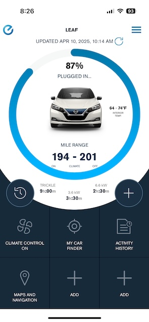
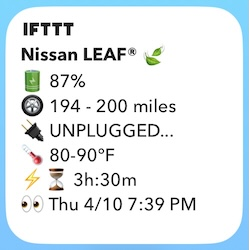
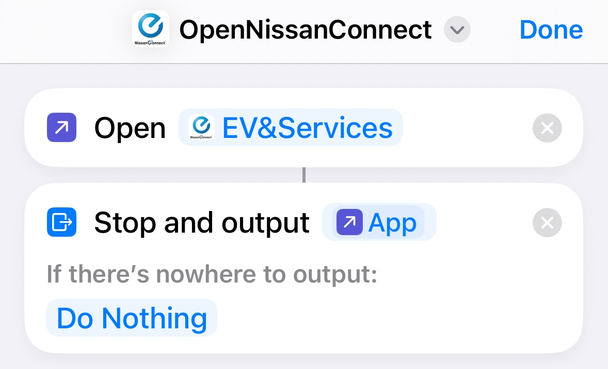
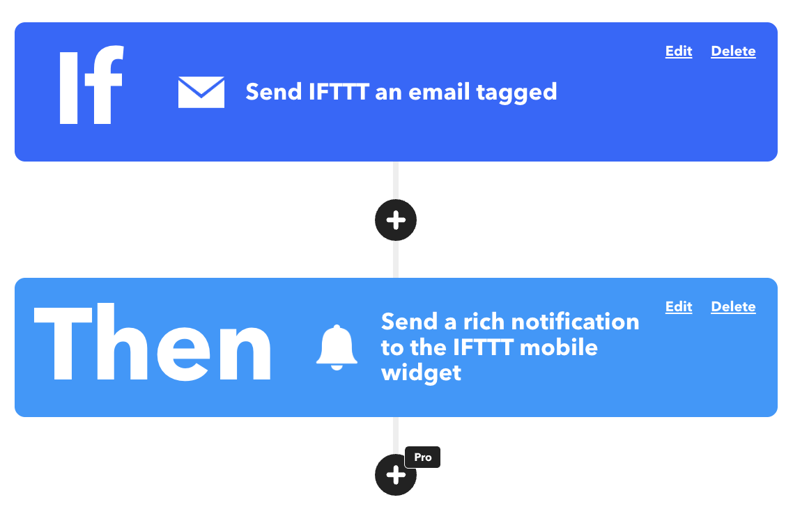
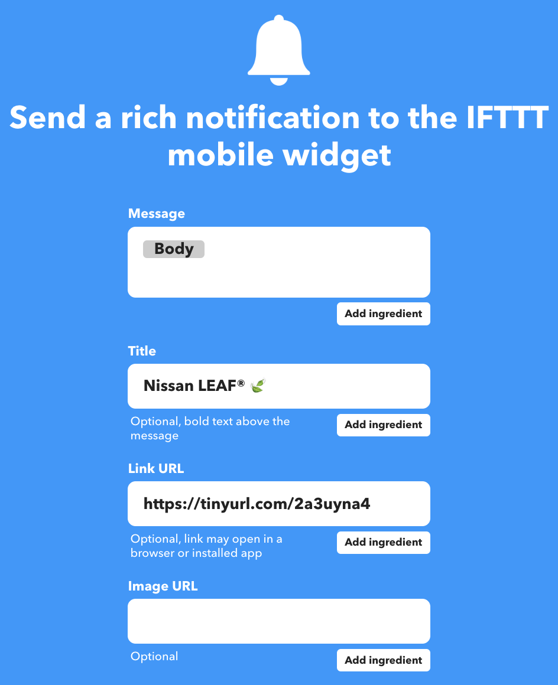

## Nissan's App
Nissan's official [NissanConnect® EV & Services iPhone app](https://apps.apple.com/us/app/nissanconnect-ev-services/id407814405):

> lets you manage the unique features of your LEAF like charging the battery, adjusting climate controls and checking the battery status, all from your mobile device

Here is a screenshot of what it looks like for my car:

The app is...fine. Here is one representative review from the [Apple App Store](https://apps.apple.com/us/app/nissanconnect-ev-services/id407814405?see-all=reviews):

![On 10/11/2023 SugimotoKoitsu reviewed the app: "Slow communication with the car: This app is pretty limited in what it does, the most useful to me being setting the cabin temperature in winter and checking charging status at work so I don’t hog one of the only two level 2 chargers at work all day. I like to take my 2023 Leaf SV+ off the charger as it nears 100%. But the app is very slow to update the status of the battery. I guess Nissan is polling the car through its cellular connection or a satellite connection, because I can’t log the car into the WiFi network at work. So maybe those methods are time consuming but it takes about five minutes to update the battery status, which is very annoying. It seems like there’s room for improvement in efficiency."](review.png)

My main issue with the app is that it lacks a home screen widget I could use to quickly check my car's battery status, unlike apps for other electric car brands like [Rivian](https://9to5mac.com/2024/04/03/rivian-lock-screen-widget-support/), [Ford](https://9to5mac.com/2024/11/12/fordpass-control-center-home-screen-widget/), and [Lucid](https://apps.apple.com/us/app/lucid-motors/id1579793272).

## Third-Party Apps

Meanwhile, others have developed their own Nissan LEAF apps with a custom user interface and additional features (some with a home screen widget!):

* [LEAF Manager by Gyathaar](https://mynissanleaf.com/threads/leaf-manager-alternative-carwings-app-for-android.11476/#post-264808)
* [EVA: Leaf by Rob Winters](https://www.speakev.com/threads/beta-testers-wanted.12259/)
* [My Leaf by Tobias Westergaard Kjeldsen](https://wkjeldsen.dk/myleaf/)

Unfortunately, I understand that none of these apps are still available to use where I live in North America. 😞

The developer of "My Leaf" [shared his frustration in a blog post](https://tobis.dk/blog/the-farce-of-nissanconnect-north-america/), explaining how Nissan's deliberate changes to their North American API forced him to discontinue support for users in the region:

> I simply won’t support it any longer because of Nissan of North America’s persistant work on blocking third party clients. I continued to try and support the API during the last 12 months. Playing cat and mouse with Nissan. I simply don’t have the time and honestly the drive to continue when I know Nissan are consistently trying to break third party clients on purpose. It’s a sad and foolishness reality indeed.

## Project Goals

Nevertheless, I decided to take on the challenge of developing an iPhone home screen widget that could show me the battery charge status of my Nissan LEAF car.

I added one more constraint to the project: no spending money. I believe Nissan's app should already provide a home screen widget, so it didn't seem fair to have to spend any money on this project. However, using tools/devices I already had access to was fair game.

Notably, that ruled out using something like [Sidecar](https://sidecar.clutch.engineering/) which appears to provide a home screen widget. I think it looks very slick, but it requires the purchase of a wireless [On-board Diagnostics (OBD)](https://en.wikipedia.org/wiki/On-board_diagnostics) scanner plus a $6.99 USD/month subscription. 😓

It also ruled out using the popular [LeafSpyPro app](https://apps.apple.com/us/app/leafspy-pro/id967376861) which similarly requires the purchase of a wireless OBD scanner and costs $19.99 USD. To my knowledge, it doesn't provide a home screen widget itself, but I think you could probably develop one using its data syncing feature.

## Results

I am happy to report I was successful and spent no money! Here is a screenshot of the widget:

And if you tap the widget, it opens the NissanConnect app. You'll notice in the following video that there are a few extra non-ideal screen transitions (more on that below), but hey, you get what you pay for!



## How it Works

To reduce the risk of any API-breaking changes, I'm just using the official NissanConnect app without any modifications:

1. I created a GitHub repo containing a GitHub Action that:
    * uses [`apkeep`](https://github.com/EFForg/apkeep) to download the NissanConnect app
    * uses [Appium](https://appium.io/) to:
        * install and launch the app on an Android device connected to the host via the Android Debugger (ADB)
        * automate tapping through the app's screen to sign into the app using provided account credentials
        * scrape and output the text of the vehicle's status after it refreshes

2. I created a separate GitHub repo containing a GitHub Actions workflow scheduled to run a job multiple times throughout the day that:
    * uses [Tailscale](https://tailscale.com/) to ephemerally connect the job's GitHub runner host to a [tailnet](https://tailscale.com/kb/1136/tailnet) on which there is already connected a [Raspberry Pi 4B](https://en.wikipedia.org/wiki/Raspberry_Pi_4) with 2 GB RAM (sitting on my desk at home) that is running [Android 15](https://konstakang.com/devices/rpi4/AOSP15/) with ADB turned on
    * connects to the Raspberry Pi via ADB
    * runs the GitHub Action from (1) using my Nissan account credentials stored in [GitHub Actions secrets](https://docs.github.com/en/actions/security-for-github-actions/security-guides/using-secrets-in-github-actions)
    * formats the scraped vehicle data and sends it in an email to [IFTTT](https://ifttt.com/)

3. I created an Apple Shortcut on my iPhone named `OpenNissanConnect` that opens the NissanConnect app: <https://www.icloud.com/shortcuts/fd139fa01719483a89fcbde391435ff7>

4. I created a free IFTTT applet that triggers on the email sent by the workflow from (2) and displays the body of the email within a ["Notification Widget"](https://help.ifttt.com/hc/en-us/articles/115010361688-How-do-I-manage-or-add-new-widgets-on-my-device) on my iPhone's home screen

The `Link URL` field contains a [TinyURL](https://tinyurl.com/) that redirects to `shortcuts://run-shortcut?name=OpenNissanConnect` which uses the [Shortcuts URL scheme](https://support.apple.com/guide/shortcuts/run-a-shortcut-from-a-url-apd624386f42/ios) to run the Apple Shortcut from (3). I did this because IFTTT seems to check that the `Link URL` you provide actually resolves to a valid web URL; otherwise, the IFTTT website just opens and displays an error when you tap on the widget.

The NissanConnect app developers could definitely make changes that would break how this widget works, but those changes would by definition probably negatively affect regular human users too which I hope they would want to avoid.

## Future Work

My original plan was to [run an Android emulator on the GitHub Actions runner in the cloud](https://github.com/ReactiveCircus/android-emulator-runner) so I wouldn't need to maintain my own Android device, and that _almost_ works (in fact, it does work on my M3 Apple Silicon macOS laptop using an `arm` Android emulator), but it seems like the NissanConnect app (or maybe the server it connects to) may detect when `x86_64` Android is being used and then refuse to sign in. Or at least, I always saw the following error when I tried both in the cloud and on an old `x86_64` laptop I had:

And unfortunately, at the time of writing, I understand:

1. a cloud VM environment must support nested virtualization in order to run an Android emulator with hardware acceleration
1. the only macOS `arm` runners GitHub provides are M1 and [M2](https://github.com/github/roadmap/issues/985) machines, but [nested virtualization is only available on M3 and later](https://developer.apple.com/documentation/virtualization/vzgenericplatformconfiguration/isnestedvirtualizationsupported#:~:text=Nested%20virtualization%20is%20available%20for%20Mac%20with%20the%20M3%20chip%2C%20and%20later.)
1. the only other `arm` runner GitHub supports is a [Linux `arm64` runner](https://github.blog/changelog/2025-01-16-linux-arm64-hosted-runners-now-available-for-free-in-public-repositories-public-preview/) whose [hardware does not support nested virtualization](https://github.com/orgs/community/discussions/19197#discussioncomment-12012161)

Luckily, the NissanConnect app has a "demo mode" that does not require signing into an account to use, so I was able to run an Android emulator in the cloud as part of [the automated continuous integration testing for the GitHub Action](https://github.com/kevincon/nissan-connect-scraper/blob/main/.github/workflows/prci.yml).

Maybe [if GitHub Actions adds support for M3 Apple Silicon runners](https://github.com/TryQuiet/quiet/issues/1879#issuecomment-2318276431) in the future, then I might be able to switch to running all of this in the cloud for free... 🤞

...or I might trade in my Nissan LEAF and get a different electric car with a better app experience before that happens. 😅
