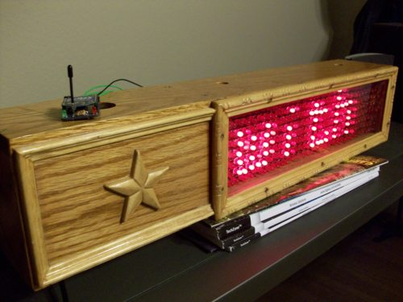

Remember that [four-panel 8x8 LED sign I programmed to scroll RSS feeds]()? Well thanks to the power of Xbee radios, now it’s wireless! The sign can now be controlled remotely from a computer connected to a transmitting Xbee radio. The transmitting Xbee wirelessly sends the data it receives over serial to the receiving Xbee, which is attached to the sign.

To do this, I bought two [Series 1 Xbee radio modules](http://www.adafruit.com/products/128) and two [Xbee adapter kits](http://www.adafruit.com/products/126) from Adafruit Industries.  The grand total was $73. The adapter kits had to be soldered, but that didn’t take very long. I also changed my Arduino code on the sign to use two GPIO pins for software-based serial communication (NewSoftSerial). That way I could still use the main header to program the Arduino with new sketches.

Adafruit also has a very helpful [user guide](http://www.ladyada.net/make/xbee/usermanual.html) for getting started with Xbee radios. I was surprised to learn that Xbees use serial AT commands, although it’s pretty strict about how it receives those commands. Apparently you have to wait a certain amount of time (in seconds) between consecutive commands, and although I was able to interact with it using AT commands, my commands were not echoed back on the terminal.

The good news is that for a simple wireless serial setup (which is what I’m doing here), you don’t have to program the Xbees at all. The Xbees are programmed by the manufacturer to have the same network ID, so they can talk with each other out of the box.

I enjoyed working with the Xbee radios, and I look forward to incorporating them into more of my projects in the future.
