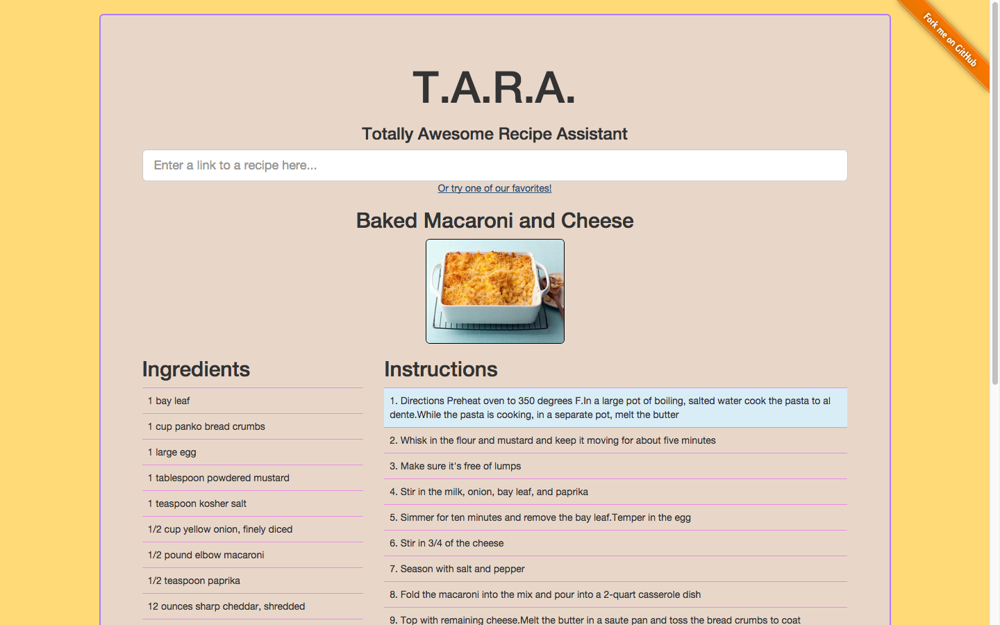
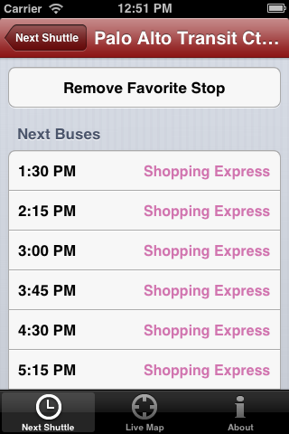
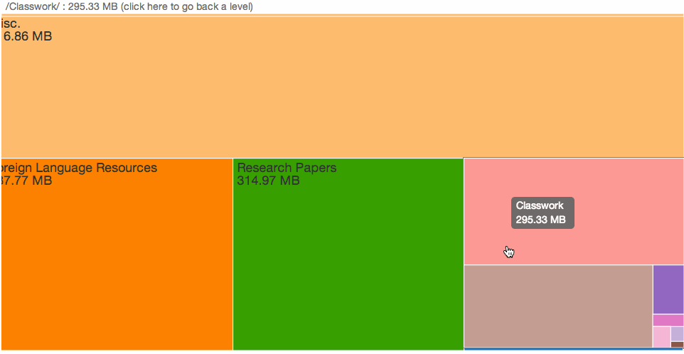
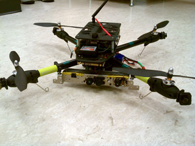
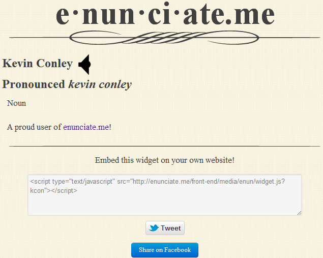
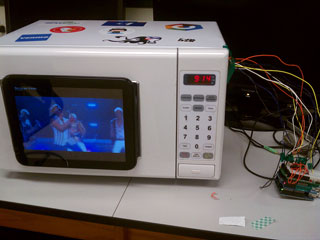
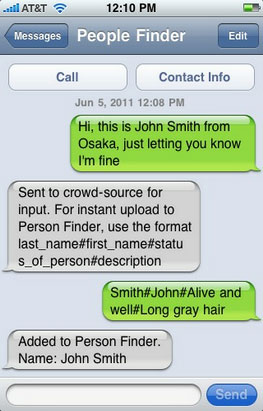
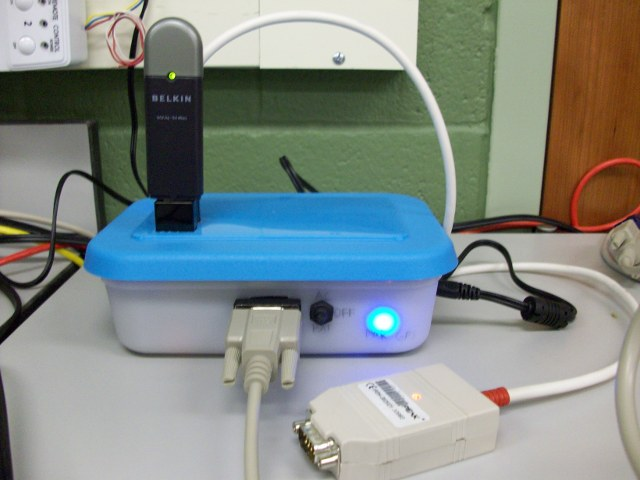
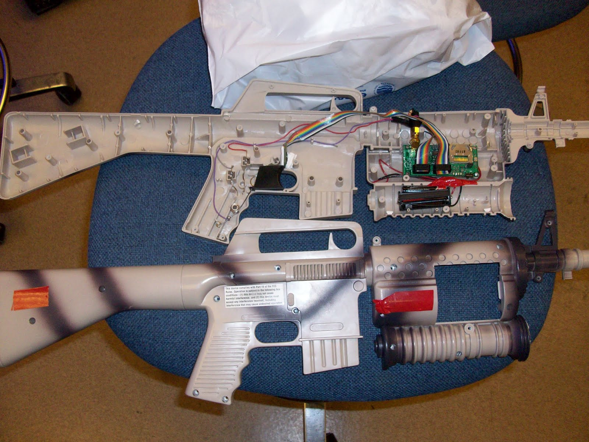
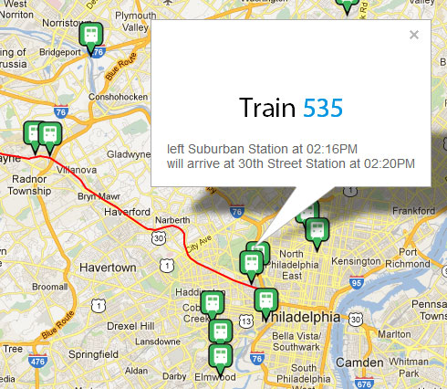

## TARA: Totally Awesome Recipe Assistant

A Meteor-based voice assistant web application for cooking with recipes.



* * *

## Stanford Marguerite iPhone App

A free, open-source iPhone app for the Stanford Marguerite shuttle bus system.



* * *

## Utility Knife

A Flask-based web app for visualizing Dropbox space/file usage as a treemap.



* * *

## Lightning Rod

A free, cross-platform Dropbox client written in Java that runs on a flash drive.

Teammates: [Evan Benshetler](http://www.linkedin.com/pub/evan-benshetler/17/930/715), [Mike Chen](http://www.linkedin.com/in/mixaelchen), [Casey Conley](http://www.linkedin.com/pub/casey-conley/45/637/867), [Bill Etter](http://williametter.com)

Awards:

* Finalist, AngelHack Hackathon, Spring 2012



* * *

## HAWK: Helicopter Aircraft Wielding Kinect

A quadrotor equipped with a Microsoft Kinect that creates 3D maps of buildings.

Teammates: Kelsey Duncombe-Smith, [Bill Etter](http://williametter.com), Paul Gurniak, Matt Hale, Alfredo Muniz, [Teddy Zhang](https://www.linkedin.com/in/ted-zhang-a854b129/)

Advisor: Rahul Mangharam

Awards:

* 2nd Place, Cornell Cup Embedded Systems Competition, 2012
* Honorable Mention, University of Pennsylvania ESE Senior Design, 2011-2012





* * *

## enunciate.me

A Django-based web app/widget that helps others learn how to pronounce your name correctly.

Teammates: [Casey Conley](http://www.linkedin.com/pub/casey-conley/45/637/867), [Varun Sampath](http://vsampath.com)

Awards:

* Best Market Potential Award, PennApps Hackathon, Spring 2012

* * *

## uWave

A microwave hacked to play YouTube videos, completed in under 40 hours.

Teammates:  [Varun Sampath](http://vsampath.com), [Ben Shyong](https://www.benshyong.com/), [Teddy Zhang](https://www.linkedin.com/in/ted-zhang-a854b129/)

Awards:

* First Place, PennApps Hackathon, Fall 2011

[Website](/uwave/)





* * *

## SMS Person Finder

A crowd-sourced, text-message interface for Google’s Person Finder disaster victim database, completed in under 24 hours.

Teammates:
* [Ted Lee](https://www.linkedin.com/in/tedleeprofile)
* Lionel Young
* Jonathan Koff
* Anup Mantri
* Dan Brown
* Deepali Singla
* Sian Liu
* and a few others

Awards:

* First Place, Random Hacks of Kindness Silicon Valley Hackathon, June 2011

[Google Blog Post](https://googleblog.blogspot.com/2011/06/thousands-of-hackers-for-good-build.html)

* * *

## AutoPlug

A prototype automotive architecture for plug-n-play services.

Teammates: Gabe Torres, [Teddy Zhang](https://www.linkedin.com/in/ted-zhang-a854b129/)

Advisor: Rahul Mangharam

Awards:

* Grand Prize, World Embedded Software Contest, 2010
* Best Presentation, Rachleff Scholars Research Symposium, 2010



* * *

## NEStalgia

A wireless rifle controller for the game [Cabal](http://en.wikipedia.org/wiki/Cabal_(video_game)) on the Nintendo Entertainment System.

Teammate: [Evan Benshetler](http://www.linkedin.com/pub/evan-benshetler/17/930/715)

[Website](https://www.cabalcontroller.blogspot.com)



* * *

## SEPTA Now

A Rails-based real-time visualization of SEPTA’s regional rail trains, completed in under 40 hours.

Teammates: [Varun Sampath](http://vsampath.com), [Ben Shyong](https://www.benshyong.com/), [Teddy Zhang](https://www.linkedin.com/in/ted-zhang-a854b129/)

Awards:

* Student Choice Award, PennApps Hackathon, Fall 2010


